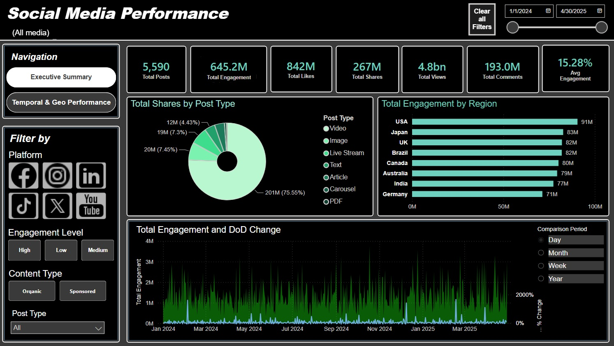
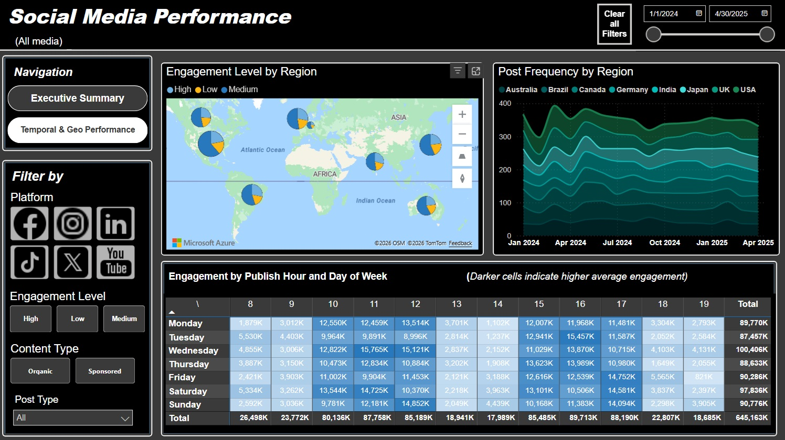

# Social Media Performance Analytics Dashboard

## Overview

This project is an interactive Power BI dashboard built to analyze social media performance across multiple platforms over a 16-month period.

The goal of the project was not only to create a visually polished dashboard, but also to perform exploratory and comparative analysis capable of generating actionable business insights related to:

* platform performance,
* content strategy,
* posting behavior,
* engagement efficiency,
* and content format effectiveness.

The dashboard was developed using Power BI, with additional data modeling and transformation performed in Power Query and DAX.

---

# Dashboard Preview

## Live Dashboard

[View Interactive Dashboard](https://app.powerbi.com/view?r=eyJrIjoiYjlhNTM0NzEtMmYzYi00NTUyLWI3OWQtZGZlODUxYTZjZjdiIiwidCI6ImEzNGM1MTliLTQ0ZDEtNGRlNi1iNTVlLWQ0NmNmZWFhODJhNSJ9)

---

## Dashboard Screenshots

### Executive Summary

### Temporal & Geo Performance

---

## Dataset

The dataset contains social media performance data from:

* Facebook
* Instagram
* LinkedIn
* TikTok
* X.com
* YouTube

### Dataset Summary

* 5,600 rows
* 5,000 unique posts
* ~16 months of data

### Date Range

* January 1st, 2024
* May 1st, 2025

Some posts were published simultaneously across multiple platforms, causing repeated Post IDs across rows.

### Main Metrics Available

* Engagement
* Views
* Likes
* Shares
* Comments
* Impressions
* Video Views
* Clicks
* CTR (Click Through Rate)

### Main Dimensions

* Platform
* Region
* Content Category
* Content Type
* Post Type
* Engagement Level
* Date and Time

---

# Dashboard Structure

## Page 1 — Executive Summary

The Executive Summary page provides a high-level overview of social media performance through:

* KPI cards,
* engagement trends,
* regional comparisons,
* content distribution,
* and interactive filtering.

### Main Features

* Total Engagement
* Total Views
* Total Likes
* Total Shares
* Average Engagement
* Daily Engagement Trend
* Engagement MoM %
* Engagement by Region
* Content Distribution by Type

### Interactive Filters

* Platform
* Engagement Level
* Content Type
* Date Range

---

## Page 2 — Temporal & Geo Performance

This page focuses on:

* geographic performance,
* posting behavior over time,
* and temporal engagement analysis.

### Main Features

* Engagement by Region (Map)
* Post Frequency by Region
* Day/Hour Engagement Heatmap

The heatmap was designed to identify behavioral patterns related to posting schedules and engagement concentration.

---

# Data Modeling

The project uses a star-schema-inspired structure with:

* a central fact table,
* a Date dimension table,
* and a Location dimension table.

Additional transformations and calculated fields were created in Power Query and DAX.

### Examples

* Custom Date table
* Extracted numeric Post Number field
* Time intelligence measures
* MoM engagement calculations
* Average Engagement metrics

---

# Key Insights

## 1. Posting Volume Does Not Reduce Engagement Efficiency

No significant correlation was found between posting frequency and engagement per post over time.

This suggests that engagement performance is driven more by content strategy than by posting cadence alone.

---

## 2. Platform Performance Behaves Differently

Each platform demonstrated distinct engagement behavior:

* Instagram achieved the highest engagement per post
* TikTok scaled efficiently with high posting volume
* LinkedIn generated lower engagement but stronger CTR-oriented behavior

This reinforces the importance of platform-specific strategy.

---

## 3. Sponsored Content Impacts Engagement More Than CTR

Sponsored content increased engagement on Facebook and TikTok, while LinkedIn performed better with organic content.

CTR remained relatively stable regardless of distribution type.

---

## 4. Product Promotion Content Performed Strongly

Contrary to common assumptions, Product Promotion posts consistently generated high engagement across platforms.

Instagram Product Promotion content was among the strongest-performing combinations in the dataset.

---

## 5. Content Format Performance Is Highly Platform-Dependent

Post format strongly affected engagement:

* Instagram and X performed exceptionally well with Video content
* LinkedIn Video posts underperformed
* Image posts performed strongly on YouTube and Facebook
* Livestream content showed relatively weak engagement

This suggests that platform-native formats are critical for maximizing engagement.

---

# Tools & Technologies

* Power BI
* Power Query
* DAX
* Excel

---

# Future Improvements

Planned future additions include:

* A dedicated “Insights & Recommendations” dashboard page
* Expanded statistical analysis
* PDF business report
* Additional storytelling visuals
* More advanced comparative analysis

---

# Project Goals

This project was designed to demonstrate:

* dashboard development,
* analytical thinking,
* data storytelling,
* exploratory data analysis,
* and business insight generation.

The focus was not only on visualization, but also on extracting meaningful strategic conclusions from the data.
